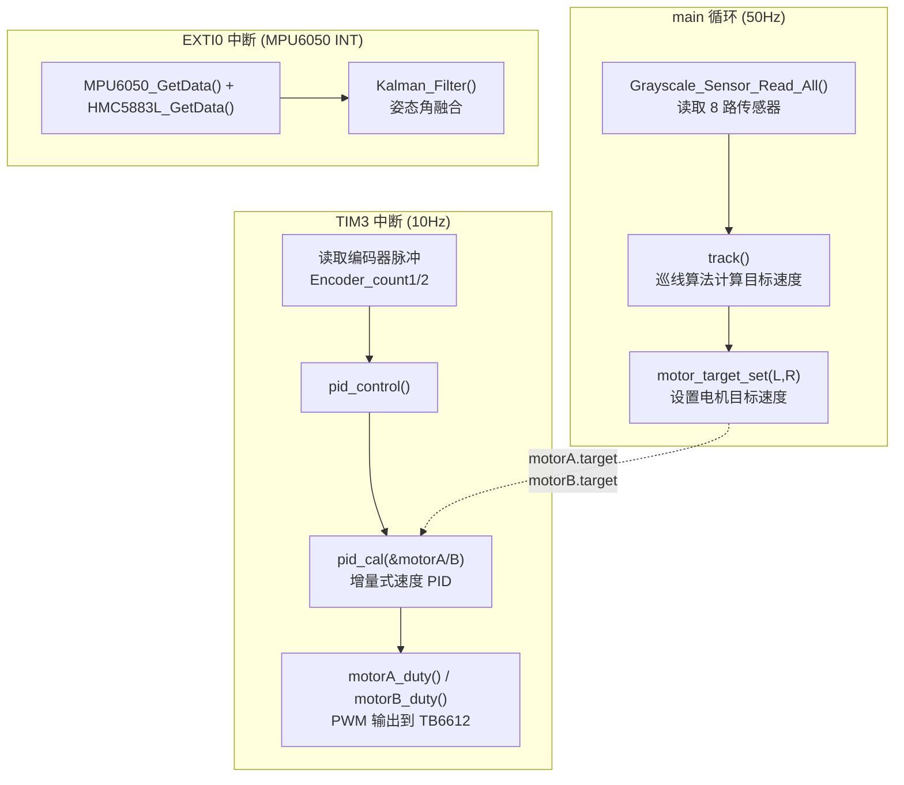
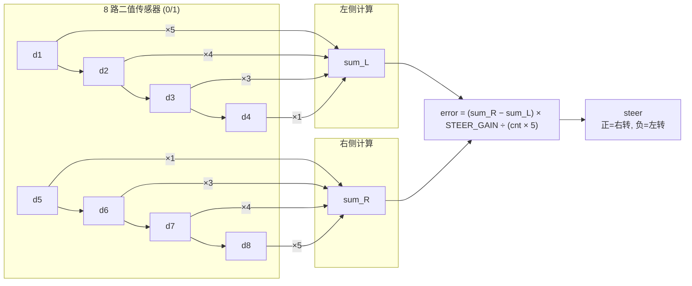
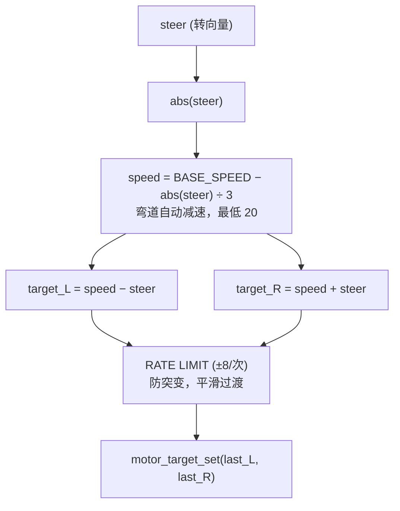
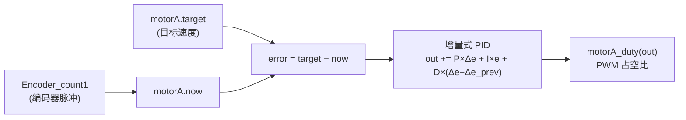
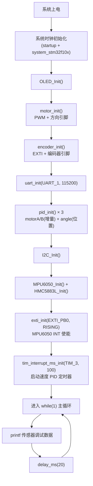

# 智能小车巡线控制系统

> STM32F103C8T6 | 8路灰度 | MPU6050 | HMC5883L | TB6612 | 编码器闭环

---

## 📁 项目结构

```
car_v1.2/
└── car/
    ├── code/                    # 应用层代码
    │   ├── motor.c/h            # 电机驱动 & 编码器初始化
    │   ├── pid.c/h              # PID 控制器 & 速度闭环
    │   ├── filter.c/h           # 卡尔曼 & 互补滤波（姿态解算）
    │   ├── grayscale_sensor.c/h # 8 路灰度传感器驱动
    │   ├── gray_track.c/h       # 巡线算法（核心）
    │   ├── uart_tune.c/h        # 串口调参工具
    │   └── readme.txt
    ├── menu/                    # OLED 两级菜单系统
    │   ├── oled.c/h             # OLED 驱动（显存架构+像素坐标+反显）
    │   ├── oled_font.c/h        # ASCII + 中文字模数据
    │   ├── key.c/h              # 3 按键驱动（PB11/PB12/PA12）
    │   └── menu.c/h             # 两级菜单框架（2024 电赛 H 题）
    ├── ml_libs/                 # 底层驱动库
    │   ├── ml_gpio.c/h          # GPIO 配置
    │   ├── ml_pwm.c/h           # PWM 输出（TIM2~4）
    │   ├── ml_tim.c/h           # 定时器中断
    │   ├── ml_uart.c/h          # 串口通信
    │   ├── ml_i2c.c/h           # 模拟 I2C（SCL=PB6, SDA=PB7）
    │   ├── ml_exti.c/h          # 外部中断
    │   ├── ml_mpu6050.c/h       # MPU6050 六轴传感器
    │   ├── ml_hmc5883l.c/h      # HMC5883L 磁力计
    │   ├── ml_oled.c/h          # OLED 旧驱动（已被 menu/oled 替代,保留备用）
    │   └── ml_delay.c/h         # 微秒/毫秒延时
    ├── sys/                     # CMSIS 系统文件
    │   ├── stm32f10x.h          # 寄存器定义
    │   ├── system_stm32f10x.c/h # 系统时钟初始化
    │   └── startup_*.s          # 启动文件
    ├── user/                    # 用户入口
    │   ├── main.c               # 主函数 & 初始化
    │   └── isr.c                # 中断服务函数
    ├── skills/                  # AI Agent 调试方法论
    └── .vscode/                 # VS Code C/C++ 配置
        └── c_cpp_properties.json
```

---

## 🔌 引脚接线表

### 电机驱动（TB6612）

| 引脚 | 信号 | 说明 |
|------|------|------|
| PA0 | PWMA | TIM2_CH1，电机 A 速度 (PWM) |
| PA1 | PWMB | TIM2_CH2，电机 B 速度 (PWM) |
| PA5 | AIN1 | 电机 A 方向控制 1 |
| PA7 | AIN2 | 电机 A 方向控制 2 |
| PA4 | BIN1 | 电机 B 方向控制 1 |
| PA3 | BIN2 | 电机 B 方向控制 2 |
| PB12 | STBY | 已硬接 3.3V，不再占用（引脚释放给 Key2） |

### 菜单按键

| 引脚 | 按键 | 说明 |
|------|------|------|
| PB11 | Key1 | 上翻 |
| PB12 | Key2 | 下翻 |
| PA12 | Key3 | 确认 / 进入菜单 |

### 编码器（速度反馈）

| 引脚 | 信号 | 说明 |
|------|------|------|
| PA6 | 编码器1 A相 | EXTI6，下降沿计数 |
| PA2 | 编码器1 B相 | 方向判断（输入上拉） |
| PB4 | 编码器2 A相 | EXTI4，下降沿计数 |
| PB5 | 编码器2 B相 | 方向判断（输入上拉） |

### 8 路灰度传感器（亚博智能）

| 引脚 | 信号 | 说明 |
|------|------|------|
| PB13 | AD0 | 通道选择 bit0（输出） |
| PB14 | AD1 | 通道选择 bit1（输出） |
| PB15 | AD2 | 通道选择 bit2（输出） |
| PA15 | OUT | 传感器数字输出（输入） |

### I2C 总线（MPU6050 + HMC5883L + OLED）

| 引脚 | 信号 | 说明 |
|------|------|------|
| PB6 | SCL | I2C 时钟（开漏） |
| PB7 | SDA | I2C 数据（开漏） |

### 其他

| 引脚 | 信号 | 说明 |
|------|------|------|
| PA9 | UART1 TX | 调试串口 (115200) |
| PA10 | UART1 RX | 调试串口 |
| PB0 | MPU6050 INT | EXTI0 上升沿，数据就绪中断 |
| PA13 | SWDIO | SWD 调试 |
| PA14 | SWCLK | SWD 调试 |

---

## 📺 OLED 两级菜单系统

基于 2024 电赛 H 题「自动行驶小车」设计，通过 3 个按键操作 OLED 128×64 屏幕。

### 菜单结构

```
一级菜单（6项，2页）
├── <- 返回（退出菜单回到巡线）
├── 任务模式选择 → 任务1: A→B / 任务2: A-B-C-D-A / 任务3: A-C-B-D-A / 任务4: 自动4圈
├── 速度参数设置 → 5 档巡线速度（FAST/MED/SLOW/SHARP/MIN）
├── PID参数调节 → 电机 A/B 的 P/I/D 值
├── 传感器数据   → 8 路灰度 + 编码器 实时刷新
└── 系统信息     → 版本 + 当前任务编号
```

### 按键操作

| 按键 | 主循环 | 菜单内 |
|------|--------|--------|
| Key3 (PA12) | 按下进入菜单 | 确认选中项 |
| Key1 (PB11) | — | 上翻 |
| Key2 (PB12) | — | 下翻 |

### OLED 驱动变更

- **旧驱动** `ml_oled.c`：行/列 API，直接写屏，无反显 → 已被 `headfile.h` 注释掉
- **新驱动** `menu/oled.c`：像素坐标 X/Y API，显存架构 `OLED_DisplayBuf[8][128]`，支持 `OLED_ReverseArea()` 高亮、`OLED_Update()` 批量刷新
- I2C 仍共用 PB6(SCL)/PB7(SDA)，与 MPU6050/HMC5883L 同一条总线

---

## 🏗️ 系统架构



### 两层控制架构

| 层级 | 运行位置 | 频率 | 功能 |
|------|----------|------|------|
| **上层：方向控制** | `main` 循环 `track()` | ~50Hz | 读灰度传感器 → 算偏差 → 设目标速度 |
| **下层：速度控制** | TIM3 中断 `pid_control()` | 10Hz | 读编码器 → 增量式 PID → PWM 输出 |

> 上层决定"往哪走、走多快"，下层保证"实际速度跟得上目标速度"。两层解耦，互不干扰。

---

## 🎯 巡线算法详解

### 核心方法：加权差比和



### 权重设计原理

```
传感器位置:   d1    d2    d3    d4  │  d5    d6    d7    d8
             最左  ←─────────────────中心────────────────→  最右
权重:          5     4     3     1  │   1     3     4     5
```

> **外层传感器权重大**（离中心远 → 位置信息多 → 对偏差贡献大）  
> **内层传感器权重小**（离中心近 → 位置信息少 → 起微调作用）

### 差比和归一化公式

$$\text{steer} = \frac{\sum_{i=4}^{7} (d[i] \times w[i]) - \sum_{i=0}^{3} (d[i] \times w[i])}{cnt \times 5} \times \text{STEER\_GAIN}$$

- 分子：右侧加权和 − 左侧加权和（正 = 线偏右）
- 分母：踩线传感器总数 × 最大权重（自动归一化，不受踩线数量影响）
- STEER_GAIN：比例系数（可调，默认 80）

### 速度输出链



### 变化率限制（Rate Limiter）

```c
// 不是直接把 target 塞给电机
// 而是每次最多变化 ±RATE_LIMIT（默认 8）
diff = target - last;
if (diff >  8) diff =  8;   // 单次最多加速 8
if (diff < -8) diff = -8;   // 单次最多减速 8
last = last + diff;          // 平滑过渡
```

> **为什么需要**：传感器在 d4/d5 边界时值可能快速跳变 0↔1，不加限制会导致电机反复急加速急减速（抖舵）。变化率限制充当"低通滤波器"，让转向平滑。

### 可调参数速查

| 参数 | 位置 | 默认值 | 调法 |
|------|------|--------|------|
| `BASE_SPEED` | `track()` | 50 | 直道速度，越大越快 |
| `STEER_GAIN` | `track()` | 80 | 转弯力度，不够→加大 |
| `RATE_LIMIT` | `track()` | 8 | 越小越平滑，越大越灵敏 |
| 电机 PID `P` | `main.c` | 10 | 速度跟随响应速度 |
| 电机 PID `I` | `main.c` | 10 | 消除稳态误差 |
| 电机 PID `D` | `main.c` | 0 | 抑制超调 |

---

## 🔄 PID 控制说明

### 电机速度 PID（增量式）



- **增量式 PID**：输出 = 上次输出 + 增量。天然抗积分饱和，适合速度控制。
- 运行频率 10Hz（TIM3, 100ms），每次清零编码器计数。

### 姿态解算（卡尔曼滤波）

MPU6050 的陀螺仪积分角度 + 加速度计/磁力计观测角度 → 卡尔曼滤波融合：

$$\text{Angle}_k = \text{Angle}_{k-1} + (\omega - \text{bias}) \cdot dt \quad \text{(预测)}$$
$$\text{Angle}_k = K \cdot \text{obs} + (1-K) \cdot \text{predict} \quad \text{(更新)}$$

三个轴（Roll/Pitch/Yaw）各有一个卡尔曼滤波器实例。

---

## 🖥️ 主函数流程



> 🔧 巡线功能通过取消注释 `Grayscale_Sensor_Read_All()` 和 `track()` 启用。

---

## 🔧 开发环境

| 项 | 说明 |
|----|------|
| **IDE** | Keil MDK v5（编译）+ VS Code（编辑） |
| **编译器** | ARMCC v5/v6 |
| **编码** | UTF-8 with BOM（所有 `.c/.h` 文件） |
| **调试器** | DAP-Link（SWD 接口，PA13/PA14） |
| **芯片型号** | STM32F103C8T6（中等容量，STM32F10X_MD） |

### VS Code 配置

项目根目录 `.vscode/c_cpp_properties.json` 已配置：
- 包含路径：`user/`, `ml_libs/`, `sys/`, `code/`, Keil ARMCC 头文件
- 宏定义：`STM32F10X_MD`, `__CC_ARM`
- IntelliSense：ARM 模式

---

## 📝 代码约定

- 库文件前缀 `ml_`：底层驱动（MengLiang Library）
- 应用层无前缀：`motor`, `pid`, `filter`, `gray_track`
- 中文注释：UTF-8 编码，Keil → Edit → Configuration → Encoding → UTF-8
- 寄存器操作：直接操作 STM32 寄存器（非标准库）
